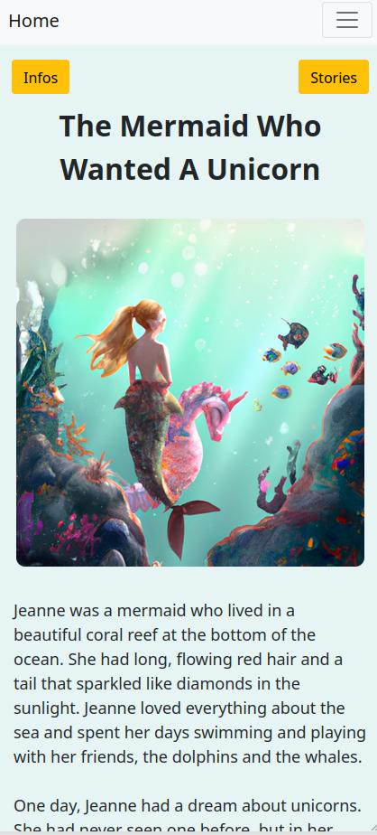
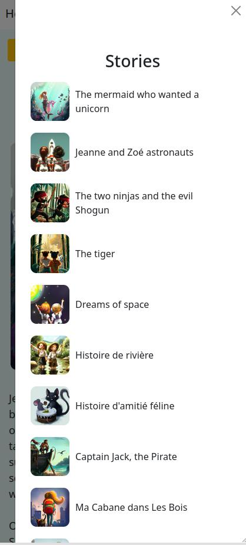
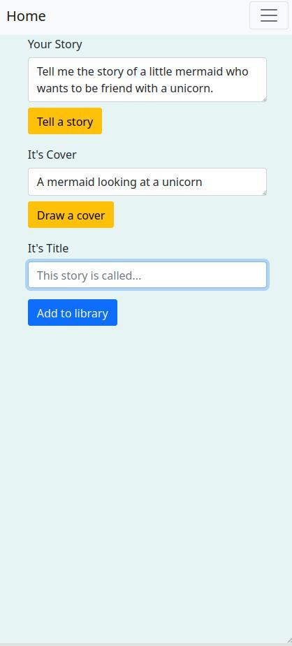

# ✨ Stories 🪄

Generate infinite stories for kids. [GPT-3.5](https://openai.com) and [DALL-E 2](https://openai.com/product/dall-e-2) based website to create and illustrate kids' stories.






## Development

You first need a running instance of [PocketBase](https://pocketbase.io/). You then need to import the `pb_schema.json` file to recreate the tables.

The following commands works with `npm` or `yarn`.
```bash
# install dependencies
pnpm install

# run locally
pnpm run dev
```

Enjoy. 🍌
